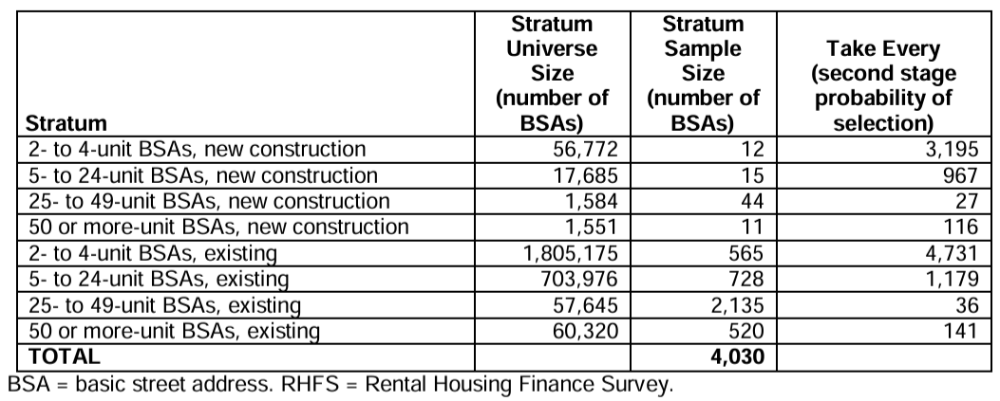

```{r setup, include = FALSE}
library(dplyr)
library(knitr)
library(htmltools)
```

```{r sidebar, echo=FALSE, results='asis'}
# Floating sidebar with hyperlinked sections
HTML('
<style>
#sidebar {
    position: fixed;
    left: 10px;
    top: 100px;
    width: 200px;
    padding: 10px;
    background: #f8f9fa;
    border: 1px solid #ccc;
    font-size: 16px;
    line-height: 1.6;
}
#sidebar ul {
    list-style-type: none;
    padding: 0;
}
#sidebar a {
    display: block;
    text-decoration: none;
    color: #007bff;
    padding: 4px 0;
}
#sidebar a:hover {
    text-decoration: underline;
}
</style>

<div id="sidebar">
    <strong>Navigation</strong>
    <ul>
        <li><a href="#intro">Introduction</a></li>
        <li><a href="#summary">Summary</a></li>
        <li><a href="#section1">Section 1: Detailed Survey Methodology</a></li>
        <li><a href="#section2">Section 2: Response Rates</a></li>
        <li><a href="#section3">Section 3: Sample Selection</a></li>
        <li><a href="#section4">Section 4: Conclusion</a></li>
    </ul>
</div>
')
```

# Introduction {#intro}
This report assesses whether the Rental Housing Finance Survey (RHFS) response rates are high enough to draw nationally-representative conclusions about U.S. landlord finances. It evaluates the 2012, 2015, 2018, and 2021 waves of the survey.

This document is dynamically generated using R Markdown and hosted on GitHub Pages. The source code and data used to generate this report are available in the [GitHub repository](https://github.com/lorae/rental-housing).

### Data Use and Access
The findings in this report are based exclusively on publicly available data from the Rental Housing Finance Survey's Public Use Files (PUFs), along with its associated codebooks, methodology reports, and supporting documentation. More detailed datasets, the Internal Use Files (IUFs), are restricted to users with data partnerships with the U.S. Census Bureau.

While both the PUFs and IUFs contain the same number of property-level observations, IUFs include additional variables that are either suppressed, topcoded, bottomcoded, or recoded PUFs to protect respondent confidentiality. For example, geographic identifiers such as census tracts are removed from PUFs. However, survey codebooks provide a complete listing of variables included in both versions, allowing public users to identify the additional fields present in the IUF, even without direct access to the restricted survey responses.

# Summary {#summary}
The Rental Housing Finance Survey (RHFS) is conducted every three years with a nationally representative sample of rental properties. To assess whether the responses received remain nationally representative, it is important to evaluate the extent and severity of missing data. Among surveyed properties, the Census Bureau distinguishes between two types of survey nonresponse:

**Unit nonresponse** occurs when no substantive data are collected from a sampled property, typically due to unsuccessful contact attempts or refusal to take the survey.

**Item nonresponse** occurs when a respondent completes the survey but skips or provides unusable answers to specific questions.

The overall response rate to a survey question is the product of the unit response rate and the item response rate. For example, in a hypothetical question about rents collection, if 50% of sampled property managers/landlords answer the survey and 50% of survey respondents provide information about rents in their property, then the overall response rate to the question is 25%.

### Unit response rates
As summarized in Table 1, unit-level survey response rates fall within a range of roughly 40% - 70%. This means that 30% to 60% of sampled properties provided no response at all.

**Table 1: Unit Response Rates in 2012, 2015, 2018, and 2021 Waves**
```{r table01, echo = FALSE}
# These numbers are hard coded since they come directly from the documentation
complete_interview <- tibble(
  year = c(2012, 2015, 2018, 2021),
  sampled = c(4030, 10257, 11338, 11510),
  eligible_after_sampling = c(3467, NA, NA, 10596),
  interviewed = c(2264, 3896, 4330, 5106)
) |>
  mutate(
    prop = interviewed/eligible_after_sampling * 100
  )

# Display the tibble as a formatted table with improved column headers
kable(
  complete_interview, 
  digits = 0, 
  col.names = c("Wave", "Initial Sample Size", "Sample Size, After Removing Non-Eligible Properties", "Complete Interviews", "Unweighted Interview Rate (%)")
)
```
Note: Sample sizes refer to number of properties. The size of the survey sample after removing non-eligible properties is not recorded in the 2015 and 2018 survey documentation. However, as described below, the best estimate for 2015 is between 5,980 and 8,824 (implying an interview rate of 44 - 65%) and the best estimate for 2018 is 6,736 (64%).

### Item response rates
```{r load_surveys, include = FALSE}
# Load in data from the four survey waves
rhfs2012 <- read.csv("data/2012/interviewprops.csv")
rhfs2015 <- read.csv("data/2015/rhfspuf2015final_011222.csv")
rhfs2018 <- read.csv("data/2018/rhfspuf2018_v2.csv")
rhfs2021 <- read.csv("data/2021/rhfspuf2021_v1_1.csv")
```

```{r count_missing, include = FALSE}
# Define a function to quickly summarize how much missing data there is
count_missing <- function(table, colname) {
  count_total <- table |> pull(Count) |> sum()
  count_missing <- table |> filter(!!sym(colname) == -9) |> pull(Count) |> sum()
  count_na <- table |> filter(!!sym(colname) == -8) |> pull(Count) |> sum()
  
  return(list(
    count_total = count_total, 
    count_missing = count_missing,
    percent_missing = (count_missing / count_total) * 100,
    count_na = count_na,
    percent_na = (count_na / count_total) * 100,
    # Exclude the NA values from both the numerator and demoninator to see the response rate
    # among eligible respondents
    percent_other = ((count_total - count_missing - count_na) / (count_total - count_na)) * 100
  ))
}

# # Example usage
# count_missing(table = rhfs2018 |> count(NUMUNITS_R, name = "Count"),
#               colname = "NUMUNITS_R")
# # Result:
# $count_total
# [1] 4330
# 
# $count_missing
# [1] 0
# 
# $percent_missing
# [1] 0
# 
# $count_na
# [1] 0
# 
# $percent_na
# [1] 0
# 
# $percent_other
# [1] 100
```

Table 2 displays item response rates to selected survey questions, listed below. Note that percentage rates are only among eligible respondents. So, for example, if a respondent replies "no" to a question about whether they have a debt for the property, their nonresponse to the mortgage interest rate question ("Not applicable") will *not* be counted as a missing answer. It is excluded from both the numerator and denominator of the response.

1. NUMUNITS_R: Number of units in property
2. MRKTVAL_R: Current market value
3. CAPRATE_R: Capitalization rate for property (Calculated as the sum of all residential and commercial rents, minus operating expenses. This numerator is divided by market value.)
4. PURPRICE_R: Purchase price of property
5. CASHDWN: Was there a cash down payment? (Y/N)
6. OPTAX_R: Previous year's real estate property taxes

**Table 2: Item Response Rates (%) to Selected Questions in 2012, 2015, 2018, and 2021 Waves**
```{r table02, echo = FALSE}
# Calculate cell values
# 1. NUMUNITS_R: Number of units in property
numunits_2012 <- count_missing(rhfs2012 |> count(NUMUNITS_R, name = "Count"), "NUMUNITS_R")$percent_other
numunits_2015 <- count_missing(rhfs2015 |> count(NUMUNITS_R, name = "Count"), "NUMUNITS_R")$percent_other
numunits_2018 <- count_missing(rhfs2018 |> count(NUMUNITS_R, name = "Count"), "NUMUNITS_R")$percent_other
numunits_2021 <- count_missing(rhfs2021 |> count(NUMUNITS_R, name = "Count"), "NUMUNITS_R")$percent_other
# 2.  MRKTVAL_R: Current market value
mrktval_2012 <- count_missing(rhfs2012 |> count(MRKTVAL_R, name = "Count"), "MRKTVAL_R")$percent_other
mrktval_2015 <- count_missing(rhfs2015 |> count(MRKTVAL_R, name = "Count"), "MRKTVAL_R")$percent_other
mrktval_2018 <- count_missing(rhfs2018 |> count(MRKTVAL_R, name = "Count"), "MRKTVAL_R")$percent_other
mrktval_2021 <- count_missing(rhfs2021 |> count(MRKTVAL_R, name = "Count"), "MRKTVAL_R")$percent_other
# 3. CAPRATE_R: Capitalization Rate
caprate_2012 <- NA # Not offered in 2012 survey
caprate_2015 <- count_missing(rhfs2015 |> count(CAPRATE_R, name = "Count"), "CAPRATE_R")$percent_other
caprate_2018 <- count_missing(rhfs2018 |> count(CAPRATE_R, name = "Count"), "CAPRATE_R")$percent_other
caprate_2021 <- count_missing(rhfs2021 |> count(CAPRATE_R, name = "Count"), "CAPRATE_R")$percent_other
# 4. PURPRICE_R: Purchase price of property
purprice_2012 <- count_missing(rhfs2012 |> count(PURPRICE_R, name = "Count"), "PURPRICE_R")$percent_other
purprice_2015 <- count_missing(rhfs2015 |> count(PURPRICE_R, name = "Count"), "PURPRICE_R")$percent_other
purprice_2018 <- count_missing(rhfs2018 |> count(PURPRICE_R, name = "Count"), "PURPRICE_R")$percent_other
purprice_2021 <- count_missing(rhfs2021 |> count(PURPRICE_R, name = "Count"), "PURPRICE_R")$percent_other
# 5. CASHDWN: Was there a cash down payment? (Y/N)
cashdwn_2012 <- NA # Not offered in 2012 survey
cashdwn_2015 <- count_missing(rhfs2015 |> count(CASHDWN, name = "Count"), "CASHDWN")$percent_other
cashdwn_2018 <- count_missing(rhfs2018 |> count(CASHDWN, name = "Count"), "CASHDWN")$percent_other
cashdwn_2021 <- count_missing(rhfs2021 |> count(CASHDWN, name = "Count"), "CASHDWN")$percent_other
# 6. OPTAX_R: Previous year's real estate property taxes
optax_2012 <- count_missing(rhfs2012 |> count(OPTAX_R, name = "Count"), "OPTAX_R")$percent_other
optax_2015 <- count_missing(rhfs2015 |> count(OPTAX_R, name = "Count"), "OPTAX_R")$percent_other
optax_2018 <- count_missing(rhfs2018 |> count(OPTAX_R, name = "Count"), "OPTAX_R")$percent_other
optax_2021 <- count_missing(rhfs2021 |> count(OPTAX_R, name = "Count"), "OPTAX_R")$percent_other

# Create a tibble for Table X
table_x <- tibble(
  Wave = c(2012, 2015, 2018, 2021),
  NUMUNITS_R = c(numunits_2012, numunits_2015, numunits_2018, numunits_2021),
  MRKTVAL_R = c(mrktval_2012, mrktval_2015, mrktval_2018, mrktval_2021),
  CAPRATE_R = c(caprate_2012, caprate_2015, caprate_2018, caprate_2021),
  PURPRICE_R = c(purprice_2012, purprice_2015, purprice_2018, purprice_2021),
  CASHDWN = c(cashdwn_2012, cashdwn_2015, cashdwn_2018, cashdwn_2021),
  OPTAX_R = c(optax_2012, optax_2015, optax_2018, optax_2021)
)

# Format and display the table
kable(
  table_x,
  digits = 2,
  col.names = c("Wave", "1. NUMUNITS_R", "2. MRKTVAL_R", "3. CAPRATE_R", "4. PURPRICE_R", "5. CASHDWN", "6. OPTAX_R")
)

```


# Section 1: Detailed Survey Methodology {#section1}

Detailed notes about survey design follow.

Unresolved question: Does the 2012 RHFS only include 2+ unit rental housing properties? It appears that the 2015 wave includes 1+ unit properties.

## 2012 Methodology

All material from this section is based upon the [2012 RHFS National Methodology, Weighting, and Error Estimation](https://www.census.gov/programs-surveys/rhfs/technical-documentation/methodology.2012.html#list-tab-2013961092) file.

**Figure 1: 2012 RHFS Survey Attrition**
```{r fig01, echo=FALSE, out.width='100%', out.height='100%'}
library(DiagrammeR)

DiagrammeR::grViz("
digraph flowchart {
  rankdir=LR;  // Left to Right Flow

  // Reduce whitespace
  graph [pad=0.1, nodesep=0.3, ranksep=0.1]

  node [shape=rectangle, style=filled, fillcolor=lightblue, fontname=Arial, width=1.5, height=0.6];

  total_bsas [label='Total Eligible BSAs\n2,704,708'];
  sampled_bsas [label='Sampled BSAs\n4,030'];
  eligible_sample [label='Eligible BSAs\n3,467'];
  completed_interview [label='Completed\nProperty-Level\nInterviews\n2,264'];

  total_bsas -> sampled_bsas -> eligible_sample -> completed_interview;
}
")
```

**Target Population**: All possible residential rental properties in the United States (in 2012)?

**Universe sampled**: The Basic Street Address (BSA) is the street address, minus the name of the apartment or unit: "For instance, in the address '123 Main Street, Apartment 102,' the '123 Main Street' portion is the BSA." 

1. First, all BSAs are selected from the U.S. Census Bureau Master Address File (MAF). [what year is this MAF up-to-date with?].
2. By merging with 2010 Census information, BSAs where [at least] 80% of the units at the address are rental are extracted.

This selection comprises the universe of potentially sampled BSAs.

**Sample selection**: The sampling process has two steps. First, Primary Sampling Units (PSUs) are selected. Then, BSAs are selected within each PSU.

1. The United States is divided into 394 Primary Sampling Units (PSUs), which are geographical boundaries that collectively cover all 50 states of land area. All PSUs with at least 100,000 housing units - 170 of them - are guaranteed selection into the sample. The remaining 224 PSUs are grouped into strata based on "similarities in various socioeconomic characteristics," and one PSU is selected per stratum to represent all PSUs in that stratum.
2. Within each PSU, BSAs with at least 80% of units identified as rental units in the 2010 census are classified as in-scope. These BSAs are divided into 8 groups, shown in Table 2. (Note: These groups are also called "strata" by the Census Bureau, but they differ from the strata grouping PSUs in step 1.) From within each of these 8 strata, a random sample is selected. In total, **4,030** BSAs were selected for participation in the 2012 RHFS.

**Table 3: 2012 RHFS Sample Size by Stratum**


**Sample refinement**: The target population for the survey is rental *properties*, not BSAs. A *property* is defined as "A BSA or a collection of BSAs and/or other buildings owned by a single entity (person, group, leasing company, and so on). For example, an apartment complex may have several buildings with unique BSAs, but they are owned as one property." Properties known to have multiple BSAs are reweighted to account for their increased probability of selection in the sample.

Even after sample selection, it is not guaranteed that all BSAs selected will be eligible for the survey. For example:

- Multiple sampled BSAs may match the same property: In this case, data are still collected on the property, but the data are collapsed so that there is only one row.
- Property was public housing
- Property is found to not contain a minimum of 80% rental units
- Building found at BSA is under construction or demolished
- BSA belongs to a manufactured housing community

After this stage of refinement, **3,467** BSAs remained in the sample.

**Noninterviews**: Of 3,467 BSAs, **2,264** were interviewed and **1,203** were classified as "Type A" noninterviews: either "(1) no one was available for data collection after repeated visits, (2) the respondent refused to be interviewed, or (3) the interviewer was unable to find the address."

This amounts to an unweighted response rate of 65%, or a weighted property-level response rate of 67%.

## 2015 Methodology

All material from this section is based upon the [2015 Rental Housing Finance Survey Methodology](https://www.census.gov/programs-surveys/rhfs/technical-documentation/methodology.2015.html#list-tab-2013961092) file.

**Figure 2: 2015 RHFS Survey Attrition**
```{r fig02, echo=FALSE, out.width='100%', out.height='100%'}
library(DiagrammeR)

DiagrammeR::grViz("
digraph flowchart {
  rankdir=LR;  // Left to Right Flow

  // Reduce whitespace
  graph [pad=0.1, nodesep=0.3, ranksep=0.1]

  node [shape=rectangle, style=filled, fillcolor=lightblue, fontname=Arial, width=1.5, height=0.6];

  total_bsas [label='Total Eligible BSAs\n4,522,722'];
  sampled_bsas [label='Sampled BSAs\n10,257'];
  eligible_sample [label='Eligible BSAs\nUnknown (best guess)\n5,980 - 8,824'];
  completed_interview [label='Completed\nProperty-Level\nInterviews\n3,887'];

  total_bsas -> sampled_bsas -> eligible_sample -> completed_interview;
}
")
```

**Target Population**: All residential rental properties in the United States, "circa 2014."

**Universe sampled**: Single and multi-unit rental housing properties from two sources ; the 2013 American Housing Survey Sample, which provides data on single unit rental housing properties, and the January 2014 Master Address File Extract Files (MAFXs), which provides data on multiunit properties. Public housing units were removed using a Department of Housing and Urban Development administrative list.

**Sample selection**: Similarly to 2012, the sampling process has two steps. First, Primary Sampling Units (PSUs) are selected. Then, BSAs are selected within each PSU.

1. First, single unit rentals were filtered to only include PSUs that were selected in the 2013 American Housing Survey. Then, multiunit buildings were filtered from the Jan 2014 MAFX subset to only include states and counties from the 2013 AHS sample PSUs.
2. It's not clear whether the 80% rental unit rule was applied to the remaining BSAs. However, as in 2012, BSAs were divided into 5 groups, or "strata", shown in Table 3. From within each of these strata, a random sample was selected. 

A higher sample size was chosen in 2015 than in 2012. "This oversample was needed for three reasons;" writes the Census Bureau, "a high non-reponse rate, a large number of ineligible properties, and a large number of sampled units that changed strata after being selected from the frame."

In total, **10,257** BSAs were selected for participation in the 2015 RHFS.

**Table 4: 2015 RHFS Sample Size by Stratum**

**Sample refinement and Noninterviews**: It's unclear how many of the 10,257 sample interviews were not completed due to ineligibility and how many were not completed due to nonresponse. Neither the technical documentation nor the PUF data itself provide information on this question.

Note that if the attrition follows the 2012 sampling pattern, then we should expect that 3467/4030 or 86% of the sampled BSAs were eligible, meaning that roughly 1433 BSAs attritted due to ineligibility and 4937 BSAs attritted due to survey refusal, inability to find address, or inability to contact. This would imply an unweighted response rate of 44%.

If we instead extrapolate using the unweighted response rate of 65% in 2012, then that would imply 3887 / 0.65 or 5980 BSAs were eligible, meaning that roughly 4277 BSAs attritted due to ineligibility and 2093 attritted due to survey refusal, inability to find address, or inability to contact.

In summary, using 2012 data, my best guess for the response rate among eligible properties is somewhere between 44% and 65%.

**Other notes**: The technical documentation warns against comparing the results to the 2018 survey wave.

*"Data users should exercise caution when making comparisons between the 2015 and 2018 Rental Housing Finance Survey estimates. The 2015 sample design used separate frames for single and multiunit addresses. Single unit rentals were selected from a frame of eligible rental units identified in the 2013 American Housing Survey (AHS) sample and multi-unit addresses were selected from a frame based on a list of basic street addresses on the Master Address File (MAF) located in 2013 AHS sample Primary Sampling Units (PSUs).  The 2018 sample design used a single frame based solely on addresses of rental units identified in the 2017 AHS.  The 2017 AHS was based on the new sample that was redesigned in 2015, while the 2013 AHS was based on the previous AHS sample design.  Thus, the poststratification of unit control totals had very different distributions across survey years. The differences between 2015 and 2018 RHFS estimates of rental properties can be largely attributed to the differences in the post-stratification of unit control totals and the increase in average property size as measured in units per property between the 2015 and 2018 RHFS sample designs."*

## 2018 Methodology

All material from this section is based upon the [2018 Rental Housing Finance Survey Methodology](https://www.census.gov/programs-surveys/rhfs/technical-documentation/methodology.2018.html#list-tab-2013961092) file.

**Figure 3: 2018 RHFS Survey Attrition**
```{r fig03, echo=FALSE, out.width='100%', out.height='100%'}
library(DiagrammeR)

DiagrammeR::grViz("
digraph flowchart {
  rankdir=LR;  // Left to Right Flow

  // Reduce whitespace
  graph [pad=0.1, nodesep=0.3, ranksep=0.1]

  node [shape=rectangle, style=filled, fillcolor=lightblue, fontname=Arial, width=1.5, height=0.6];

  total_bsas [label='Total Eligible BSAs\nUnknown'];
  sampled_bsas [label='Sampled BSAs\n11,338'];
  eligible_sample [label='Eligible BSAs\nUnknown (best guess)\n6,736'];
  completed_interview [label='Completed\nProperty-Level\nInterviews\n4,331'];

  total_bsas -> sampled_bsas -> eligible_sample -> completed_interview;
}
")
```

**Target Population**: All residential rental properties in the United States, "circa 2017."

**Universe sampled**: "Buildings with at least one unit that is either rented or [vacant-for-rent]," as identified in the 2017 AHS sample. Public housing units were removed using a Department of Housing and Urban Development administrative list.

**Sample selection**: All rental units identified in the 2017 AHS sample were part of the sampling frame, which contained 22,620 BSAs. Of those BSAs, 11,338 were selected for the RHFS sample. [As far as I am aware, this was a 2-step sampling process, like 2012 and 2015 waves of the RHFS: I believe the AHS sample is selected from PSUs, but I would have to externally corroborate.]

As was the case in 2015, a high sample size was chosen. "This oversample was needed for three reasons;" writes the Census Bureau, "a high non-response rate, a large number of ineligible properties, and a large number of sampled units that changed strata after being selected from the frame." For some strata, like the 5-24 units and 25-49 units strata, the entire frame was selected,  since the target sample size exceeded the number of units in the frame.

In total, **11,338** BSAs were selected for participation in the 2018 RHFS.

**Table 5: 2018 RHFS Sample Size by Stratum**


**Noninterviews**: Of the selected BSAs, the average rate of response was 64.3%. The methodology document does not specify whether this is weighted or unweighted percentage, but the 2012 survey had a similar response rate (65% unweighted, 67% weighted), so the difference is likely not substantive.

Applying the interview rate to completed interviews, I estimate that (4,331 / 0.643 = ) 6,736 BSAs were eligible for interview.

## 2021 Methodology

All material from this section is based upon the [2021 Rental Housing Finance Survey Methodology](https://www.census.gov/programs-surveys/rhfs/technical-documentation/methodology.2021.html#list-tab-2013961092) file.

**Figure 4: 2021 RHFS Survey Attrition**
```{r fig04, echo=FALSE, out.width='100%', out.height='100%'}
library(DiagrammeR)

DiagrammeR::grViz("
digraph flowchart {
  rankdir=LR;  // Left to Right Flow

  // Reduce whitespace
  graph [pad=0.1, nodesep=0.3, ranksep=0.1]

  node [shape=rectangle, style=filled, fillcolor=lightblue, fontname=Arial, width=1.5, height=0.6];

  total_bsas [label='Total Eligible BSAs\nUnknown'];
  sampled_bsas [label='Sampled BSAs\n11,510'];
  eligible_sample [label='Eligible BSAs\n10,596'];
  completed_interview [label='Completed\nProperty-Level\nInterviews\n5,210'];

  total_bsas -> sampled_bsas -> eligible_sample -> completed_interview;
}
")
```


**Target Population**: All residential rental properties in the United States, "circa 2020."

**Universe sampled**: All 2019 AHS sample units that were either rented, owner occupied and listed as "for sale or rent", or vacant-for-rent were eligible. The sampling unit is a building with at least one unit that is rented or vacant-for-rent.


**Sample selection**: All rental units identified in the 2019 AHS sample were part of the sampling frame, which contained 31,739 units. Of those units, 11,510 were selected for the RHFS sample. [As far as I am aware, this was a 2-step sampling process, like 2012 and 2015 waves of the RHFS: I believe the AHS sample is selected from PSUs, but I would have to externally corroborate.]

*"[T]he 2021 RHFS sample was selected from the 2019 AHS but surveyed in 2021. The 2019 AHS sample is selected in late calendar year 2018 and includes new housing units built and ready for occupancy as of late 2018. As such, the RHFS sample will not include any rental properties built between late 2018 and 2020. The total number of rental units in 2+ properties built in 2019 was 321,000 and the number built in 2020 was 348,000"*

As was the case in 2015 and 2018, a high sample size was chosen. "This oversample was needed for three reasons;" writes the Census Bureau, "non-response, ineligible properties, and sampled units that changed strata after being selected from the frame." The entire frame was selected for the 25-49 units stratum because the target sample size exceeded the number of units in the frame.

In total, **11,510** [what?]s were selected for participation in the 2021 RHFS. Of those sampled, **10,596** were identified as eligible after removing those with "missing owner information, duplicates, public housing status, or change in rental status."

**Table 6: 2021 RHFS Sample Size by Stratum**


**Noninterviews**: Of the **10,596** eligible cases, **5,210** complete interviews were conducted.

# Section 2: Response Rates {#section2}
placeholder

# Section 3: Sample Selection {#section3}
placeholder

# Section 4: Conclusion {#section4}
placeholder
