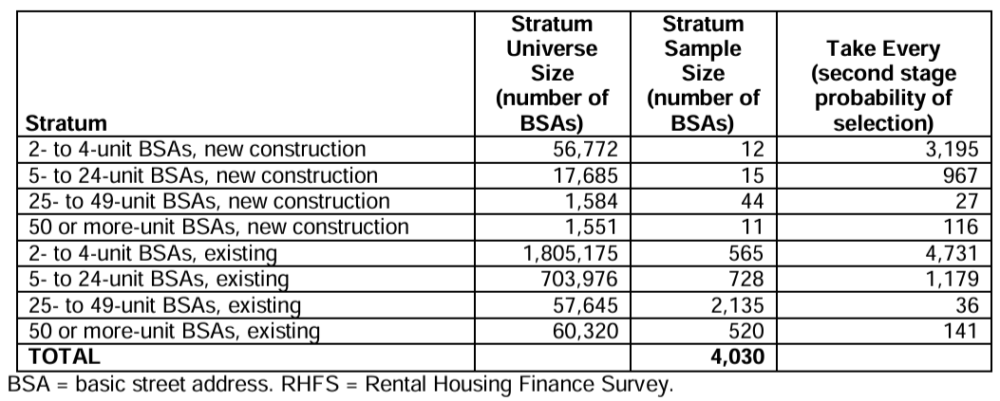
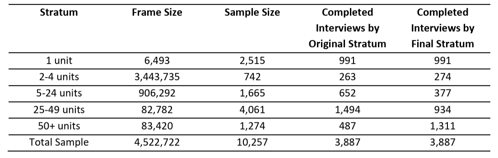

```{r setup, include = FALSE}
library(dplyr)
library(knitr)
```

The purpose of the document is to evaluate response rates in the 2012, 2015, 2018, and 2021 waves of the Rental Housing Finance Survey (RHFS).

# Response Rates
The RHFS is administered every 3 years such that a random geographically-representative sample of 

**Table 1: Response Rates in 2012, 2015, 2018, and 2021 Waves**
```{r table01, echo = FALSE}
# These numbers are hard coded since they come directly from the documentation
complete_interview <- tibble(
  year = c(2012, 2015, 2018, 2021),
  sampled = c(4030, 10257, 11338, 11510),
  interviewed = c(2260, 3896, 4330, 5106)
) |>
  mutate(
    prop = interviewed/sampled * 100
  )

# Display the tibble as a formatted table with improved column headers
kable(
  complete_interview, 
  digits = 0, 
  col.names = c("Wave", "Sample Size", "Completed Interviews", "Complete Interview Rate (%)")
)
```

# Survey design
Detailed notes about survey design follow.

Unresolved question: Does the 2012 RHFS only include 2+ unit rental housing properties? It appears that the 2015 wave includes 1+ unit properties.

## 2012 Methodology

All material from this section is based upon the [2012 RHFS National Methodology, Weighting, and Error Estimation](https://www.census.gov/programs-surveys/rhfs/technical-documentation/methodology.2012.html#list-tab-2013961092) file.

**Figure 1: 2012 RHFS Survey Attrition**
```{r fig01, echo=FALSE, out.width='100%', out.height='100%'}
library(DiagrammeR)

DiagrammeR::grViz("
digraph flowchart {
  rankdir=LR;  // Left to Right Flow

  // Reduce whitespace
  graph [pad=0.1, nodesep=0.3, ranksep=0.1]

  node [shape=rectangle, style=filled, fillcolor=lightblue, fontname=Arial, width=1.5, height=0.6];

  total_bsas [label='Total Eligible BSAs\n2,704,708'];
  sampled_bsas [label='Sampled BSAs\n4,030'];
  eligible_sample [label='Eligible BSAs\n3,467'];
  completed_interview [label='Completed Interviews\n2,264'];

  total_bsas -> sampled_bsas -> eligible_sample -> completed_interview;
}
")
```

**Target Population**: All possible residential rental properties in the United States (in 2012)?

**Universe sampled**: The Basic Street Address (BSA) is the street address, minus the name of the apartment or unit: "For instance, in the address '123 Main Street, Apartment 102,' the '123 Main Street' portion is the BSA." 

1. First, all BSAs are selected from the U.S. Census Bureau Master Address File (MAF). [what year is this MAF up-to-date with?].
2. By merging with 2010 Census information, BSAs where [at least] 80% of the units at the address are rental are extracted.

This selection comprises the universe of potentially sampled BSAs.

**Sample selection**: The sampling process has two steps. First, Primary Sampling Units (PSUs) are selected. Then, BSAs are selected within each PSU.

1. The United States is divided into 394 Primary Sampling Units (PSUs), which are geographical boundaries that collectively cover all 50 states of land area. All PSUs with at least 100,000 housing units - 170 of them - are guaranteed selection into the sample. The remaining 224 PSUs are grouped into strata based on "similarities in various socioeconomic characteristics," and one PSU is selected per stratum to represent all PSUs in that stratum.
2. Within each PSU, BSAs with at least 80% of units identified as rental units in the 2010 census are classified as in-scope. These BSAs are divided into 8 groups, shown in Table 2. (Note: These groups are also called "strata" by the Census Bureau, but they differ from the strata grouping PSUs in step 1.) From within each of these 8 strata, a random sample is selected. In total, **4,030** BSAs were selected for participation in the 2012 RHFS.

**Table 2: 2012 RHFS Sample Size by Stratum**


**Sample refinement**: The target population for the survey is rental *properties*, not BSAs. A *property* is defined as "A BSA or a collection of BSAs and/or other buildings owned by a single entity (person, group, leasing company, and so on). For example, an apartment complex may have several buildings with unique BSAs, but they are owned as one property." Properties known to have multiple BSAs are reweighted to account for their increased probability of selection in the sample.

Even after sample selection, it is not guaranteed that all BSAs selected will be eligible for the survey. For example:

- Multiple sampled BSAs may match the same property: In this case, data are still collected on the property, but the data are collapsed so that there is only one row.
- Property was public housing
- Property is found to not contain a minimum of 80% rental units
- Building found at BSA is under construction or demolished
- BSA belongs to a manufactured housing community

After this stage of refinement, **3,467** BSAs remained in the sample.

**Noninterviews**: Of 3,467 BSAs, **2,264** were interviewed and **1,203** were classified as "Type A" noninterviews: either "(1) no one was available for data collection after repeated visits, (2) the respondent refused to be interviewed, or (3) the interviewer was unable to find the address."

This amounts to an unweighted response rate of 65%, or a weighted property-level response rate of 67%.

## 2015 Methodology

All material from this section is based upon the [2015 Rental Housing Finance Survey Methodology](https://www.census.gov/programs-surveys/rhfs/technical-documentation/methodology.2015.html#list-tab-2013961092) file.

**Figure 2: 2015 RHFS Survey Attrition**
```{r fig02, echo=FALSE, out.width='100%', out.height='100%'}
library(DiagrammeR)

DiagrammeR::grViz("
digraph flowchart {
  rankdir=LR;  // Left to Right Flow

  // Reduce whitespace
  graph [pad=0.1, nodesep=0.3, ranksep=0.1]

  node [shape=rectangle, style=filled, fillcolor=lightblue, fontname=Arial, width=1.5, height=0.6];

  total_bsas [label='Total Eligible BSAs\n4,522,722'];
  sampled_bsas [label='Sampled BSAs\n10,257'];
  eligible_sample [label='Eligible BSAs\n??'];
  completed_interview [label='Completed Interviews\n3,887'];

  total_bsas -> sampled_bsas -> eligible_sample -> completed_interview;
}
")
```

**Target Population**: All possible residential rental properties in the United States, "circa 2014."

**Universe sampled**: Single and multi-unit rental housing properties from two sources ; the 2013 American Housing Survey Sample, which provides data on single unit rental housing properties, and the January 2014 Master Address File Extract Files (MAFXs), which provides data on multiunit properties. Public housing units were removed using a Department of Housing and Urban Development administrative list.

**Sample selection**: Similarly to 2012, the sampling process has two steps. First, Primary Sampling Units (PSUs) are selected. Then, BSAs are selected within each PSU.

1. First, single unit rentals were filtered to only include PSUs that were selected in the 2013 American Housing Survey. Then, multiunit buildings were filtered from the Jan 2014 MAFX subset to only include states and counties from the 2013 AHS sample PSUs.
2. It's not clear whether the 80% rental unit rule was applied to the remaining BSAs. However, as in 2012, BSAs were divided into 5 groups, or "strata", shown in Table 3. From within each of these strata, a random sample was selected. 

A higher sample size was chosen in 2015 than in 2012. "This oversample was needed for three reasons;" writes the Census Bureau, "a high non-reponse rate, a large number of ineligible properties, and a large number of sampled units taht changed strata after being selected from the frame."

In total, **10,257** BSAs were selected for participation in the 2015 RHFS.

**Table 3: 2015 RHFS Sample Size by Stratum**

**Sample refinement and Noninterviews**: It's unclear how many of the 10,257 sample interviews were not completed due to ineligibility and how many were not completed due to nonresponse. Neither the technical documentation nor the PUF data itself provide information on this question.

Note that if the attrition follows the 2012 sampling pattern, then we should expect that 3467/4030 or 86% of the sampled BSAs were eligible, meaning that roughly 1433 BSAs attritted due to ineligibility and 4937 BSAs attritted due to survey refusal, inability to find address, or inability to contact. This would imply an unweighted response rate of 44%.

If we instead extrapolate using the unweighted response rate of 65% in 2012, then that would imply 3887 / 0.65 or 5980 BSAs were eligible, meaning that roughly 4277 BSAs attritted due to ineligibility and 2093 attritted due to survey refusal, inability to find address, or inability to contact.

In summary, using 2012 data, my best guess for the response rate among eligible properties is somewhere between 44% and 65%.

TODO: email and ask what number of the 10,257 BSA interviews were not completed due to ineligible properties, and what number of the 10,257 BSA interviews were not completed due to inability to reach the respondent, and what number of the 10,257 BSAs sampled were not completed due to nonresponse / survey refusal. I've downloaded the PUF and that doesn't give any additional information: All the `OUTCOME` codes are 501, "Interview complete."

**Other notes**: The technical documentation warns against comparing the results to the 2018 survey wave.

*"Data users should exercise caution when making comparisons between the 2015 and 2018 Rental Housing Finance Survey estimates. The 2015 sample design used separate frames for single and multiunit addresses. Single unit rentals were selected from a frame of eligible rental units identified in the 2013 American Housing Survey (AHS) sample and multi-unit addresses were selected from a frame based on a list of basic street addresses on the Master Address File (MAF) located in 2013 AHS sample Primary Sampling Units (PSUs).  The 2018 sample design used a single frame based solely on addresses of rental units identified in the 2017 AHS.  The 2017 AHS was based on the new sample that was redesigned in 2015, while the 2013 AHS was based on the previous AHS sample design.  Thus, the poststratification of unit control totals had very different distributions across survey years. The differences between 2015 and 2018 RHFS estimates of rental properties can be largely attributed to the differences in the post-stratification of unit control totals and the increase in average property size as measured in units per property between the 2015 and 2018 RHFS sample designs."*
