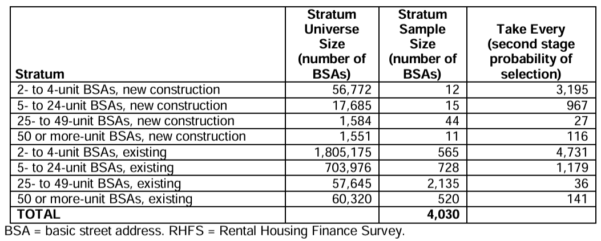

Rental Housing Finance Survey Response Rate Evaluation
================
March 4, 2025

The purpose of the document is to evaluate response rates in the 2012,
2015, 2018, and 2021 waves of the Rental Housing Finance Survey (RHFS).

# Response Rates

The RHFS is administered every 3 years such that a random
geographically-representative sample of

**Table 1: Response Rates in 2012, 2015, 2018, and 2021 Waves**

| Wave | Sample Size | Completed Interviews | Complete Interview Rate (%) |
|-----:|------------:|---------------------:|----------------------------:|
| 2012 |        4030 |                 2260 |                          56 |
| 2015 |       10257 |                 3896 |                          38 |
| 2018 |       11338 |                 4330 |                          38 |
| 2021 |       11510 |                 5106 |                          44 |

# Survey design

Detailed notes about survey design follow.

## 2012 [Methodology Page](https://www.census.gov/programs-surveys/rhfs/technical-documentation/methodology.2012.html#list-tab-2013961092)

**Target Population**: All possible residential rental population in the
United States (in 2012)?

**Universe sampled**: The Basic Street Address (BSA) is the street
address, minus the name of the apartment or unit: “For instance, in the
address ‘123 Main Street, Apartment 102,’ the ‘123 Main Street’ portion
is the BSA.”

1.  First, all BSAs are selected from the U.S. Census Bureau Master
    Address File (MAF). \[what year is this MAF up-to-date with?\].
2.  By merging with 2010 Census information, BSAs where \[at least\] 80%
    of the units at the address are rental are extracted.

This selection comprises the universe of potentially sampled BSAs.

**Sample selection**: The sampling process has two steps. First, Primary
Sampling Units (PSUs) are selected. Then, BSAs are selected within each
PSU.

1.  The United States is divided into 394 Primary Sampling Units (PSUs),
    which are geographical boundaries that collectively cover all 50
    states of land area. All PSUs with at least 100,000 housing units -
    170 of them - are guaranteed selection into the sample. The
    remaining 224 PSUs are grouped into strata based on “similarities in
    various socioeconomic characteristics,” and one PSU is selected per
    stratum to represent all PSUs in that stratum.
2.  Within each PSU, BSAs with at least 80% of units identified as
    rental units in the 2010 census are classified as in-scope. These
    BSAs are divided into 8 strata, shown in Table 2.

**Table 2: 2012 RHFS Sample Size by Stratum**

